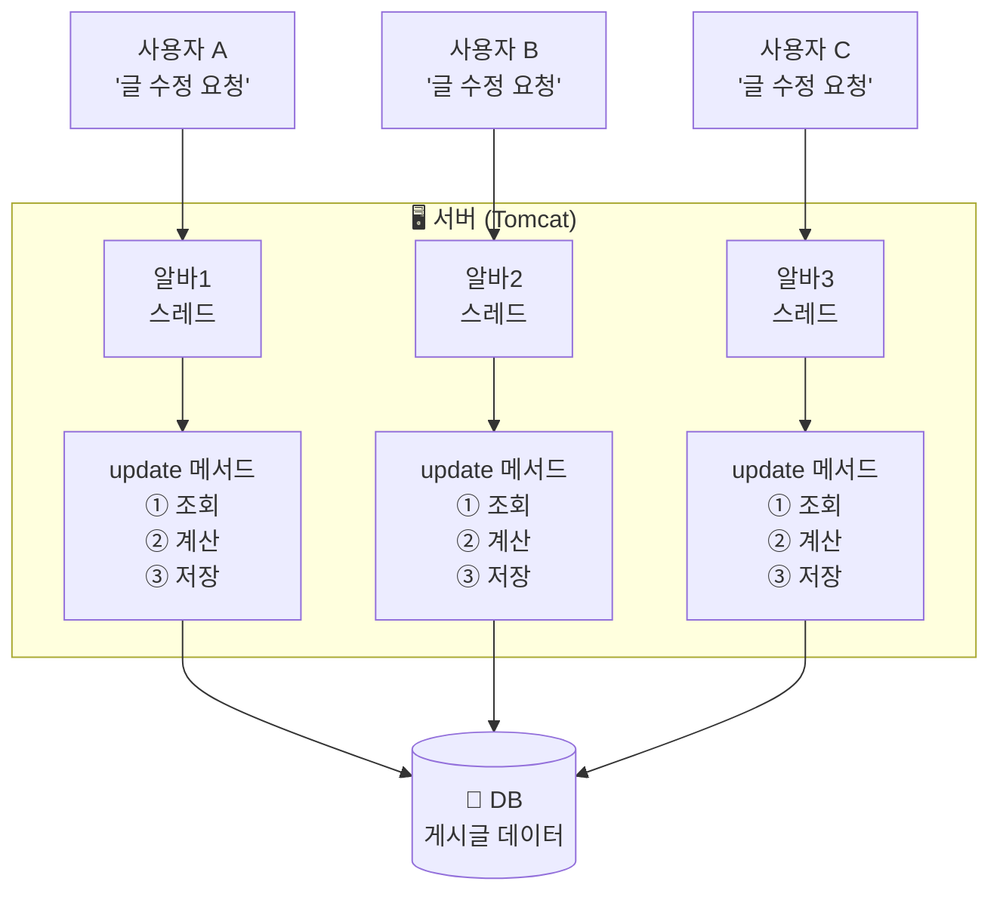
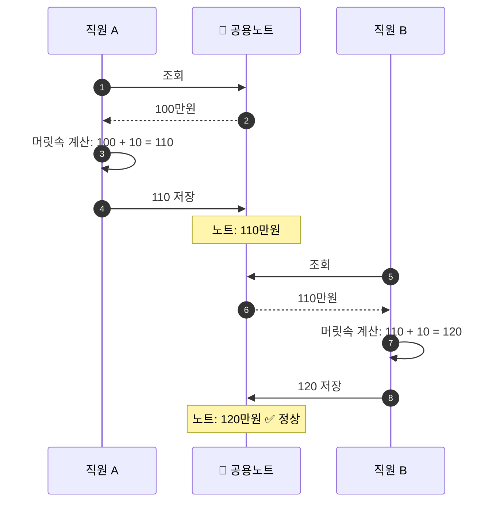
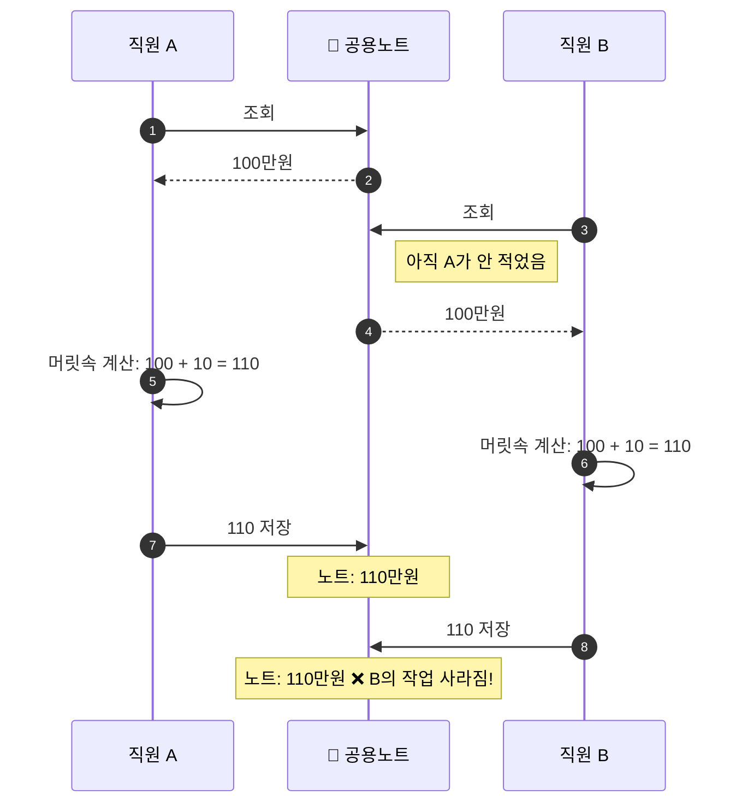
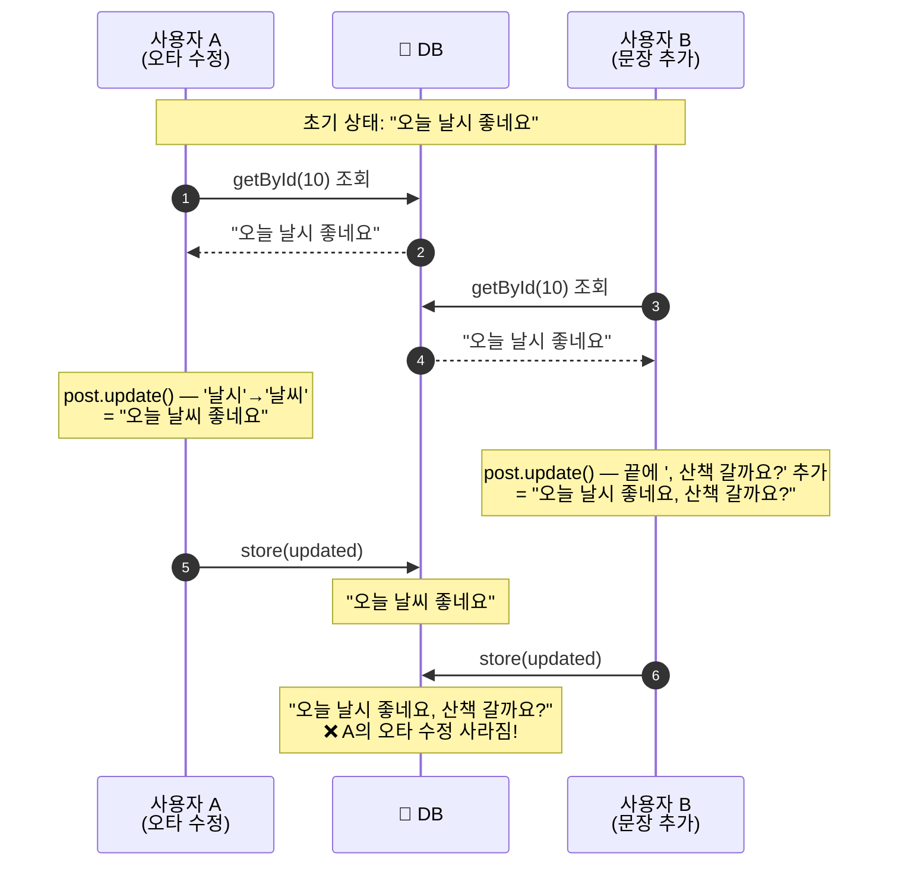
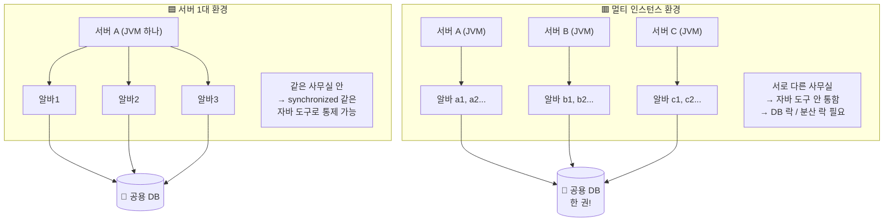

# 왜 동시성 제어가 필요한가

---

> 2회차 학습의 첫 번째 글. **동시성 제어가 왜 필요한지** 그 배경을 이해하는 데서 시작한다.
>
> 해법(어떻게 막을까)은 다음 글에서 다룬다. 여기서는 "문제가 진짜로 존재한다"는 것만 확실히 잡는다.

> 🎯 **이번 글의 목표**: 다음 한 문장을 진짜로 이해하기.
>
> > "내가 짠 코드는 혼자 실행되지 않는다. 그래서 통제가 필요하다."

## TL;DR

- 서버는 사용자 요청을 **동시에** 처리한다. 그래서 같은 메서드가 **동시에 여러 번 실행**될 수 있다.
- 이때 **값이 바뀌기 전에 모두가 같은 값을 조회**해버리면, **나중에 저장한 쪽이 앞 사람을 덮어써서** 누군가의 작업이 사라진다.
- 게다가 요즘 서버는 **여러 대(멀티 인스턴스)** 띄우는 게 기본이다. 모두가 같은 DB를 공유하니, 같은 문제가 더 광범위하게 일어난다.
- → 그래서 **동시성 제어**가 필요하다.

---

## 1. 출발점 — 1회차 코드는 "괜찮았다"

1회차 게시판 CRUD를 떠올려보자. 코드는 대략 이렇게 생겼었다.

```kotlin
fun update(command: UpdatePostCommand): UpdatePostResult {
    val post = postPort.getById(command.id)        // ① 조회
    val updated = post.update(...)                 // ② 계산
    return UpdatePostResult.from(postPort.store(updated))  // ③ 저장
}
```

위에서 아래로 한 줄씩 흐른다. **순차적이고 혼자라는 가정** 아래선 아무 문제 없다. 그래서 1회차 코드는 "동작은 한다."

그런데 현실은 이렇지 않다.

---

## 2. 첫 번째 깨달음 — 내 메서드는 "혼자" 실행되지 않는다

### 그런데 잠깐, 코드는 위에서 아래로 한 줄씩 실행되는 거 아닌가?

맞다. 코드 **한 덩어리** 안에서는 위에서 아래로 흐른다. 1회차 update 메서드도 "조회 → 계산 → 저장" 순서로 실행된다.

**문제는, 그 "코드 덩어리" 자체가 "동시에 여러 번" 실행될 수 있다는 것이다.**

### 🍜 비유: 라면집

라면집 사장님이 1명이고, 손님 한 명씩 오면 라면도 한 그릇씩 만들면 된다. **순차적**.

그런데 손님 10명이 동시에 들이닥쳤다. 한 명씩 처리하면 10번째 손님은 1시간 기다려야 한다. 망한다.

그래서 사장님은 **알바 10명을 고용**한다. 알바들이 동시에 각자 라면을 끓인다. 빠르다.

### ☕ 서버에서 일어나는 일

서버도 똑같다. 사용자 요청 100개가 동시에 들어왔는데 한 개씩 처리하면 100번째 사용자는 1시간을 기다려야 한다. **이런 서비스는 존재할 수 없다.**

그래서 서버는 **알바(스레드)를 미리 여러 명 고용**해둔다. 톰캣(Tomcat) 기본은 약 200명. 요청이 오면 놀고 있는 알바에게 일을 시킨다.

```javascript
사용자 A 요청 도착 → 알바1에게 시킴 → 알바1이 update 메서드 실행
사용자 B 요청 도착 → 알바2에게 시킴 → 알바2가 update 메서드 실행
사용자 C 요청 도착 → 알바3에게 시킴 → 알바3이 update 메서드 실행
```

**여기 중요한 포인트:**

- 알바1, 알바2, 알바3은 각자 다른 사용자의 요청을 처리 중이다.
- 그런데 셋이 실행하는 코드는 **같은 update 메서드**다.
- 즉, **같은 메서드가 3명의 알바 손에서 동시에 돌아가고 있다.**

### 📊 그림으로 보기



3명의 사용자 요청이 각자 다른 알바(스레드)에게 할당되지만, 알바들은 **모두 같은 update 메서드를 실행**하고, **모두 같은 DB**를 건드린다.

> 🔑 **첫 번째 핵심**
>
> 내가 짠 메서드는 "한 번에 한 번만 실행되는 것"이 아니다.
> 실제 서버에서는 **여러 알바(스레드)가 동시에 같은 메서드를 실행**하고 있다.

---

## 3. 두 번째 깨달음 — 같은 데이터를 동시에 건드리면 문제가 생긴다

알바들이 **각자 다른 일**을 한다면 사실 아무 문제 없다. 문제는 **같은 데이터**를 동시에 건드릴 때 시작된다.

### 📝 비유: 공용 노트

회사에 공용 노트가 한 권 있다. 거기 **"이번 달 매출 합계"**가 적혀있다. 현재 값: **100만원**.

직원 A와 직원 B가 동시에 **"내 영업실적 10만원을 더해야 해"** 라고 노트를 가지러 왔다.

**제대로 순서가 지켜지면:**

```javascript
A: 노트 보고 100만원 확인 → 110만원으로 고쳐 씀
B: 노트 보고 110만원 확인 → 120만원으로 고쳐 씀
결과: 120만원 ✅
```

**그런데 동시에 하면 이렇게 된다:**

```javascript
T1: A가 노트 조회 → 100 봄. (이때 노트는 진짜 100)
T2: B가 노트 조회 → 100 봄. (이때도 노트는 진짜 100. A는 아직 안 적었음)
T3: A가 머리에서 +10 계산 → 머릿속에 110
T4: B가 머리에서 +10 계산 → 머릿속에 110
T5: A가 노트에 110 적음.   (이제 노트는 110)
T6: B가 노트에 110 적음.   ← 문제!
```

**최종 결과: 110만원.**

B가 분명히 10만원을 더했는데, 그 10만원이 **흔적도 없이 사라졌다.**

### 📊 정상 시나리오 vs 동시성 문제 시나리오

**😇 정상 시나리오 (순차 처리)** — 결과 120만원 ✅



**💥 동시성 문제 시나리오 (동시 처리)** — 결과 110만원 ❌



두 다이어그램을 비교하면 차이가 명확하다. **순차 처리에서는 B가 조회하기 전에 A가 이미 110을 저장**해서 B가 정확한 값(110)을 보고 +10을 한다. **동시 처리에서는 A가 저장하기 전에 B가 조회**해서 둘 다 100을 보고 +10을 하니, 결국 둘 다 110을 적고 한 명의 작업이 사라진다.

### 🤔 왜 이런 일이 일어났나?

B의 입장에서 보자.

- B가 T2에 노트를 봤을 때, **노트는 진짜로 100만원이었다.** (A는 아직 안 적었으니까)
- 그래서 B는 "100에 10 더하면 110"이라고 정확하게 계산했다.
- B는 잘못한 게 없다. **잘못 본 것도 아니다.**

그런데 왜 결과가 틀렸을까?

**문제는 "조회한 시점의 값"과 "저장하는 시점의 진짜 값" 사이에 시간 차가 있었다는 것이다.** 그 시간 동안 A가 노트를 바꿔놨는데, B는 그걸 알 방법이 없었다.

> 💡 **스스로 이해한 표현으로**
>
> > "업데이트 메서드가 **값이 바뀌기 전에 조회를 해버리면**, 둘 다 100이라고 생각할 수밖에 없고, 결국 문제가 생긴다."
>
> 이게 동시성 문제의 본질이다. 책에 나오는 "Race Condition", "Lost Update" 같은 용어들은 이 한 문장을 멋있게 표현한 것에 불과하다.

> 🔑 **두 번째 핵심**
>
> 같은 데이터를 동시에 "조회 → 계산 → 저장" 하는 알바들 사이에서,
> **나중에 저장한 쪽이 앞 사람의 변경을 덮어쓴다.**
> 결과적으로 **누군가의 작업이 사라진다.**

---

## 4. 내 코드에 적용 — update 메서드의 위험

내가 1회차에 짠 update 메서드를 다시 보자.

```kotlin
val post = postPort.getById(command.id)        // ① 조회 = 노트 보기
val updated = post.update(...)                 // ② 계산 = 머릿속에서 고치기
return UpdatePostResult.from(postPort.store(updated))  // ③ 저장 = 노트에 적기
```

**공용 노트랑 구조가 완전히 똑같다.**

### 시나리오: 같은 글을 두 사람이 동시에 수정

글 ID=10인 게시글을 두 사람이 동시에 열었다.

원본:

```javascript
제목: "안녕하세요"
본문: "오늘 날시 좋네요"  ← '날시' 오타
```

- A는 오타 '날시'를 '날씨'로 고치고 저장.
- B는 본문 끝에 ", 산책 갈까요?" 를 덧붙이고 저장.

```javascript
T1: 알바1(A 처리) 조회 → "날시 좋네요"
T2: 알바2(B 처리) 조회 → "날시 좋네요"   ← A는 아직 저장 안 함
T3: 알바1 계산 → "날씨 좋네요"
T4: 알바2 계산 → "날시 좋네요, 산책 갈까요?"
T5: 알바1 저장 → DB: "날씨 좋네요"
T6: 알바2 저장 → DB: "날시 좋네요, 산책 갈까요?"  ← A의 수정 덮어씀!
```

**최종 결과: "날시 좋네요, 산책 갈까요?"**

**A의 오타 수정이 통째로 사라졌다.** B는 잘못한 게 없다. 단지 B가 조회한 그 시점에 노트(DB)에는 아직 A의 수정이 반영되지 않았을 뿐이다.

공용 노트와 똑같은 일이 내 게시판에서도 그대로 일어난다.

### 📊 게시글 동시 수정 시퀀스



공용 노트의 "100 → 110 → 110" 패턴이 게시글에서는 "원본 → A수정본 → B수정본"으로 바뀌었을 뿐, **본질은 동일하다.**

---

## 5. 세 번째 깨달음 — 서버가 여러 대면 문제가 더 광범위해진다

지금까지는 **서버 1대 안에서** 일어나는 일이었다. 그런데 2회차 과제의 환경은 **멀티 인스턴스**. 즉 서버를 **여러 대** 띄운다.

### 🏢 비유 확장: 공용 노트가 여러 회사에서

지금까지 공용 노트는 **한 회사 안에** 있었다. 직원들이 같은 사무실의 노트 한 권을 공유했다.

이제 **회사가 3개**다. (= 서버 인스턴스 3대)

```javascript
회사1 (서버A)     회사2 (서버B)     회사3 (서버C)
직원 a1, a2...   직원 b1, b2...   직원 c1, c2...
      │                │                │
      └────────────────┼────────────────┘
                       ▼
                  공용 노트 (DB)
                  "매출: 100만원"
```

중요한 질문: **공용 노트(DB)는 몇 권인가?**

**한 권이다.** 회사 3개가 같은 노트를 공유한다.

그러면 회사1의 a1과 회사2의 b2가 동시에 노트를 보고 100을 확인하고 +10을 계산하면... **같은 문제가 또 생긴다.** 이번엔 **회사가 다른** 직원들 사이에서.

> 🔑 **세 번째 핵심**
>
> 서버 1대 안의 알바들끼리뿐 아니라,
> **서버가 여러 대일 때 서로 다른 서버의 알바들 사이에서도** 같은 문제가 생긴다.
> 모두 **같은 DB(공용 노트)**를 보고 있기 때문이다.

### 그래서 왜 중요한가?

서버 1대일 때와 여러 대일 때, **공통점과 차이점**을 짚어보자.

**공통점**

- 둘 다 같은 DB를 공유하기 때문에 **동시성 문제가 발생한다.**

**차이점**

- **서버 1대**: 알바들이 같은 사무실(같은 JVM) 안에 있어서 서로 통제할 수 있다. "내가 노트 쓸 동안 기다려" 같은 신호가 통한다. → 자바의 `synchronized` 같은 도구로 통제 가능.
- **서버 여러 대**: 알바들이 **다른 사무실(다른 JVM)**에 있어서 신호가 안 통한다. 회사1에서 "잠깐만!" 외쳐도 회사2 직원은 못 듣는다. → 모두가 공유하는 **DB 자체에서 통제**하거나, **별도의 중앙 통제소(분산 락)**가 필요.

환경이 다르면 해결법도 달라진다. 이건 다음 글들에서 다룰 내용이다.

### 📊 서버 1대 vs 멀티 인스턴스 비교



**왼쪽**은 알바들이 같은 사무실(JVM) 안에 있어 서로 신호를 주고받을 수 있다. **오른쪽**은 사무실(JVM)이 분리되어 있어 신호가 안 통한다. 그래서 모두가 보는 DB 자체에서 통제하거나, 별도의 중앙 통제소(분산 락)가 필요해진다.

---

## 6. 정리 — 왜 동시성 제어가 필요한가

1. 서버는 사용자 요청을 **동시에** 처리한다. (= 알바/스레드가 여러 명)
2. 그래서 **같은 메서드가 동시에 여러 번 실행**될 수 있다.
3. 이때 **값이 바뀌기 전에 모두가 같은 값을 조회**해버리면, 나중에 저장한 쪽이 앞 사람을 덮어써서 **누군가의 작업이 사라진다.**
4. 게다가 요즘 서버는 **여러 대(멀티 인스턴스)** 띄우는 게 기본이다.
5. 같은 DB를 공유하니, 서버 안에서도, 서버끼리도 같은 문제가 일어난다.
6. 그래서 **환경에 맞는 동시성 제어**가 필요하다.

### 친구에게 한 문장으로 설명하면

> 서버는 보통 여러 대가 띄워져 있고, 모두 같은 DB를 공유해. 그런데 사용자들이 동시에 같은 데이터를 수정하면, **둘 다 원본을 보고 작업한 뒤 차례로 저장하기 때문에, 나중에 저장한 쪽이 앞 사람의 변경을 덮어써.** 그러면 누군가의 수정이 사라져 버려. 그래서 이런 일을 막기 위해 **동시성 제어**가 필요해.

---

## 🤔 학습하면서 막혔던 지점들 (회고)

### "내가 짠 메서드가 동시에 여러 번 실행된다고?"

처음엔 잘 와닿지 않았다. 코드를 보면 위에서 아래로 한 줄씩 흐르는 것처럼 보였기 때문이다.

**관점을 두 가지로 분리하니 명확해졌다.**

- **코드를 짠 입장**: 메서드 안에서는 1번 줄 → 2번 줄 → 3번 줄 순서로 흐른다. (맞음)
- **서버에서 실제 돌아가는 모습**: 같은 메서드가 알바 여러 명에게 동시에 주어진다. 알바 각자는 1→2→3 순으로 가지만, **알바들끼리는 동시에** 진행된다.

### "B가 잘못 조회한 거 아닌가?"

공용 노트 비유에서 "조회 자체가 이미 틀린 거 아니냐"고 생각했다.

사실은 **B가 조회한 그 순간엔 노트가 진짜로 100**이었다. B는 정확하게 봤다. 문제는 **그 후, B가 저장하기 전에 A가 노트를 바꿔놨다**는 것. B는 그걸 알 방법이 없었다.

**조회가 틀린 게 아니라, "조회와 저장 사이에 시간 차가 있는" 게 문제**다.
